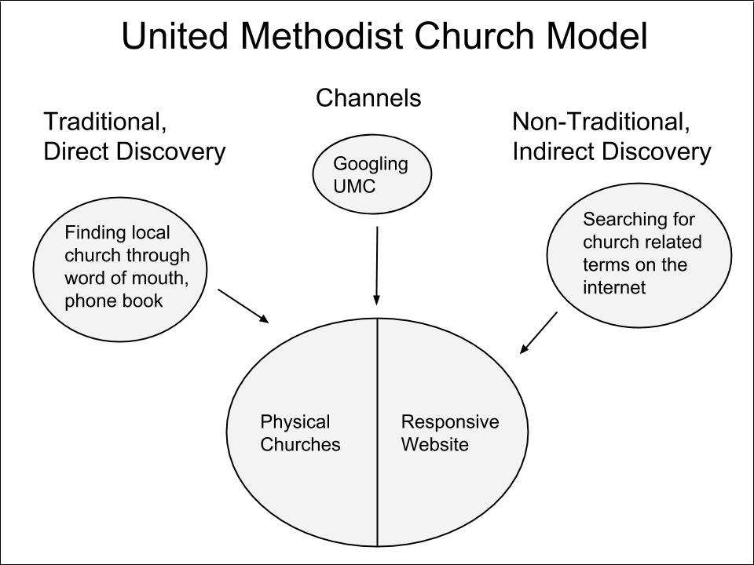

# Research Sprint

## Summary of Results

### Software and Mobile Eating the World, Global Reorganization 

"Software and mobile are eating the world" and a "global reorganization" is happening. The number of unconnected is shrinking as, between 2014 and 2020, "another billion people will come online" via smartphones, with "80% of the adults on earth" having a smartphone by 2020. This includes people in "places where it's hard to get electricity or water" and for whom the smartphone will be their first computer, and the only computer they can afford, but powerful enough to give them access to vast online resources. Communities of people, no matter their geographical proximity, are reorganizing in the cloud. (References: [Why Software Is Eating The World](http://online.wsj.com/article/SB10001424053111903480904576512250915629460.html) by [Marc Andreessen](https://twitter.com/pmarca), [Ben and Marc Explain (Practically) Everything – Part 1](http://a16z.com/2014/08/25/a16z-podcast-ben-and-marc-explain-practically-everything-part-1) by [Marc Andreessen](https://twitter.com/pmarca) and [Ben Horowitz](https://twitter.com/bhorowitz), [Mobile is Eating the World](http://a16z.com/2014/10/28/mobile-is-eating-the-world) by [Benedict Evans](https://twitter.com/BenedictEvans), and [Software is Reorganizing the World](http://www.wired.com/2013/11/software-is-reorganizing-the-world-and-cloud-formations-could-lead-to-physical-nations) by [Balaji Srinivasan](https://twitter.com/balajis)) 

### Declining Interest in Traditional Mainstream Church and Rising Interest in Mobile Church

Worldwide (predominantly U.S.) interest in the Google search phrase [United Methodist Church](http://www.google.com/trends/explore#q=United%20Methodist%20Church) as well as [Catholic, Presbyterian, Baptist](http://www.google.com/trends/explore#q=United%20Methodist%2C%20Catholic%2C%20Presbyterian%2C%20Baptist&cmpt=q&tz=) (other mainline churches) has been steadily declining.

Meanwhile, worldwide interest in the Google search phrases [LifeChurch and The Bible App](http://www.google.com/trends/explore#q=LifeChurch%2C%20The%20Bible%20App) has been on the rise. [LifeChurch](http://www.life.church) is a contemporary, mobile-first church (LifeChurch's flagship mobile app is the [Bible App](https://www.bible.com)) that I am using as a case study (due to its rising popularity, rare for a church) to contrast against the United Methodist Church. 

This interest in LifeChurch and the Bible App correlates with the rise in popularity of Google search phrases related to smartphone use and apps starting with the revolutionary introduction of the iPhone in 2007 ([iPhone, app, Android, desktop, website](http://www.google.com/trends/explore#q=iPhone%2C%20app%2C%20Android%2C%20desktop%2C%20website&cmpt=q&tz=)), and decline in popularity of Google search phrases related to desktop and website, and rise in popularity of Google search phrases related to smartphone use, apps, and livestreaming for church ([church iPhone, church app, church Android, church desktop, church website](http://www.google.com/trends/explore#q=church%20iPhone%2C%20church%20app%2C%20church%20Android%2C%20church%20livestream&cmpt=q&tz=)). 

### Reinvention to Avoid Disruption

Even industries with previously no connection at all to software (such as churches) are being "eaten by software," as more services are being delivered (and expected to be delivered) online. By leveraging software, small teams are able to create global, online organizations that are cheaper than ever to maintain and that threaten to disrupt slower-moving, large-scale, established incumbent organizations. 

Though search volume for the Google search phrase "United Methodist Church" is far greater than that for "LifeChurch" and "The Bible App" (Google Trends graph for phrases [United Methodist Church, LifeChurch, The Bible App](http://www.google.com/trends/explore#q=United%20Methodist%20Church%2C%20LifeChurch%2C%20The%20Bible%20App)), this is the sort of David and Goliath story warned of in [Why Software Is Eating The World](http://online.wsj.com/article/SB10001424053111903480904576512250915629460.html) by [Marc Andreessen](https://twitter.com/pmarca). 

LifeChurch and its Bible App began very similarly to other technology startups (such as Amazon, Google) that have disrupted industries, with founders with previous web development and entrepreneurial experience working (literally) out of a garage. Like the United Methodist Church, LifeChurch has physical churches and web properties. The biggest difference between the United Methodist Church and LifeChurch though is that LifeChurch has the Bible App. Because of its straightforward, relevant name and popularity, the Bible App is discovered often via app store search or Google search. The Bible App Google search result leads to the the Bible App website, or Bible App listing in Apple and Google app stores, where the Bible App is very highly ranked due to its popularity. As the Bible App becomes more popular, it rises higher and higher in the app store rankings and is discovered by more people, only making it more popular. Furthermore, the Bible App leads its users to LifeChurch's website, which includes livestreamed services, concerts, and other contemporary Christian entertainment. LifeChurch is therefore well positioned to take advantage of the shift to smartphones. 

That the United Methodist Church does not currently have a mobile app means it is missing the opportunity to adapt to modern lifestyles. With a well-made, well-named, and promoted mobile app, the United Methodist Church could create a network effect among pre-existing membership that would cause the app to rise in the app store rankings based on power law and create a network effect. The app could be discovered by ecumenical users and potential new church members, such as people in mobile-only developing countries, where new membership in the United Methodist tends to be skyrocketting (as opposed to in the U.S. and other developed countries where membership is declining). Ministering via mobile app to people who can only afford a smartphone is in and of itself a ministry. 

For the United Methodist Church to reinvent itself to operate similarly to LifeChurch would be difficult though. While much of the United Methodist Church's operating budget comes from the offering plate, LifeChurch has a less conventional business model that involves, in part, revenue generated through its mobile app and online donations, as well as mentoring from a member of a prominent Venture Capital fund. LifeChurch also has a much smaller staff to support, again, not unlike a traditional technology startups. 

### Lightning Demos

The United Methodist Church Model

LifeChurch Model

