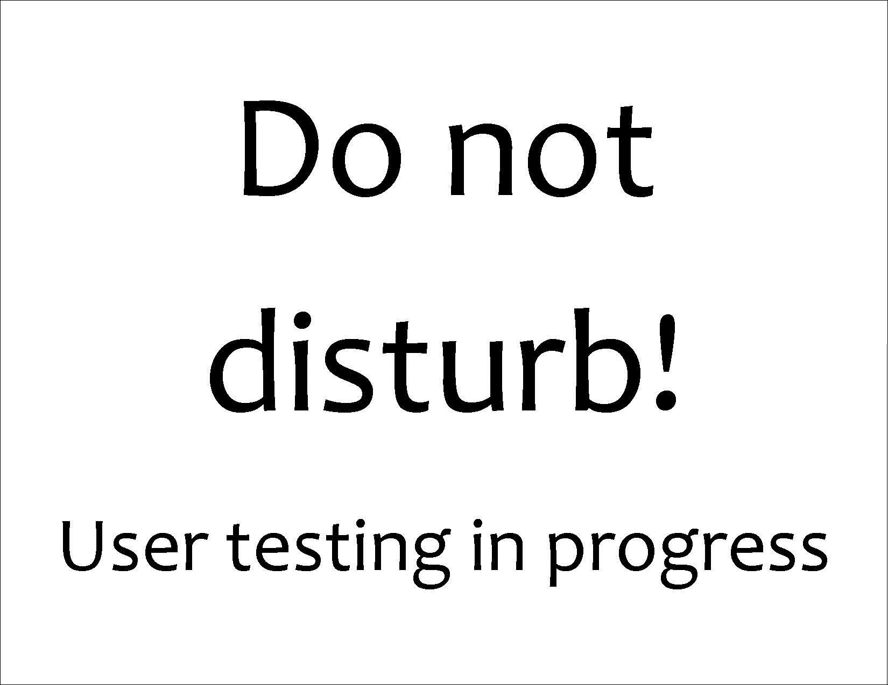
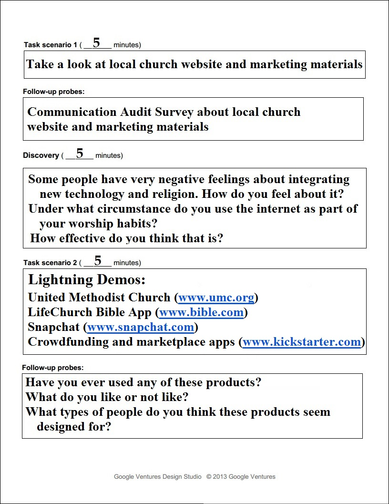

# User Testing Setup and Interviews

## Testing setup

* Cleaned desk, computer, screen
* Removed extraneous files from computer destop 
* Moved prototype file to desktop
* Did a test run of prototype
* Opened lightning demo and mobile app use case links in a browser
* Printed interview guide and placed in clipboard alongside notepad and pen
* Cleaned room
* Placed a "Do not disturb! User testing in progress" sign on the door
* After each interview, reset testing setup, including prototype

The user testing interviews would be done using the [Prototype](prototype/prototype.md) that was the end result of my Design Sprint. 

## High level agenda 

High level agenda and interview guide info as a [Word doc](https://drive.google.com/file/d/0B02bpu7HZwJRSkh5bGVzVXZTQ28/view?usp=sharing) or [PDF](https://drive.google.com/file/d/0B02bpu7HZwJRaWN1UEdVNU1hMkk/view?usp=sharing)

* Welcome
* Communication audit survey about local church marketing materials
* "User Discovery"
* Lightning demos
* Church App prototype
* Task scenarios and follow-up probes
* Debrief, feedback
* Thank you and goodbye

## Interview guide 

I used Google Ventures ["User Research, Quick 'n' Dirty,"](https://www.dropbox.com/s/6kef5x79ap8f9v7/User-Research-Workshop_Google-Ventures_Feb2013.pdf) as an interview planning resource.

See [User Stories and Personas](user-stories-and-personas.md) for more information about the user stories and personas used during the User Testing. 
